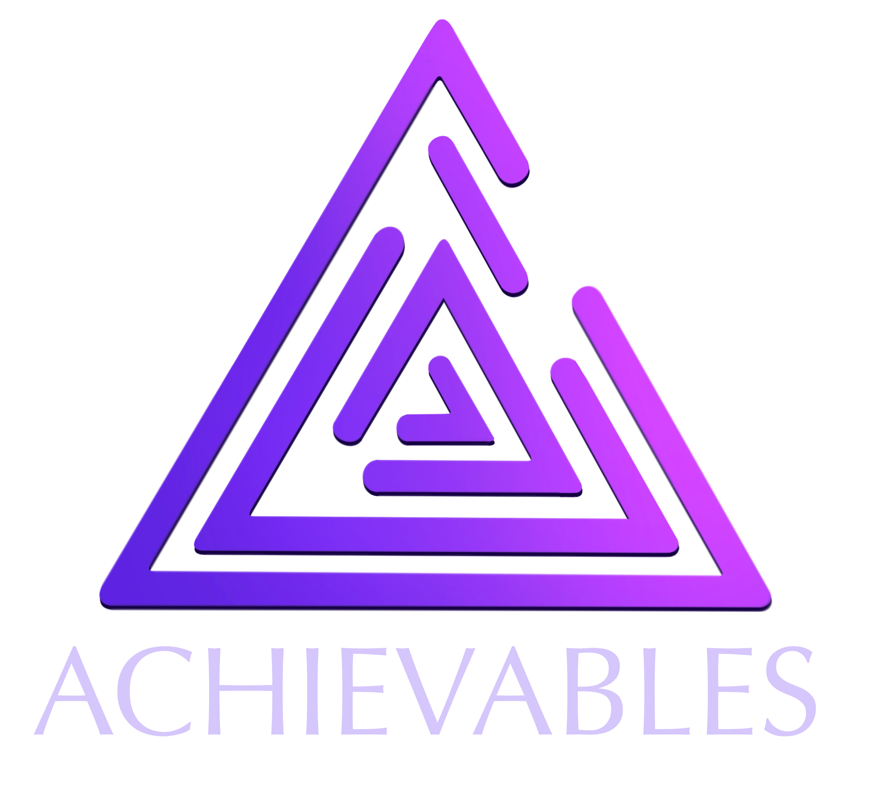

# Achievables – NFT Achievement Portfolio

A decentralized app where students mint their academic achievements as ERC-721 NFTs and present them as a verifiable on-chain portfolio.

<p align="center">
  
</p>


<!-- TODO: add screenshot -->

## Overview

Achievables reworks a general-purpose NFT marketplace into a portfolio platform for students. The idea: each passed course or earned skill becomes an NFT "badge" (for example, the bundled `Programiranje 1` badge from FON, University of Belgrade), owned by the student's wallet and visible to recruiters and companies.

The project grew out of my earlier course project, [ITEH-NFTMarketplace](https://github.com/lakygosh/ITEH-NFTMarketplace). Both repos share the same smart contract and Sepolia deployment; this one changes the product direction.

| | ITEH-NFTMarketplace | NFTMarketplace (this repo) |
|---|---|---|
| Concept | Art marketplace ("Buy and Sell") | Student achievement portfolio ("Study and Achieve") |
| Minting | User sets a sale price | Price fixed at 0, badges are not for sale |
| Trading | Purchase and change-price flows wired to the contract | Buying and price changes disabled in the UI |
| Extra UI | – | Profile modal (department, specialties, badges), Collections page prototype |
| Branding | "FD" logo, teal theme | Achievables logo, purple theme, IPFS-hosted assets |

## Key features

- **Wallet login with MetaMask**: connects the account on load and reloads on chain or account changes.
- **Mint achievement NFTs**: upload an image, add a title and description, pin the file to IPFS through Pinata, then mint with a 0.01 ETH fee.
- **On-chain gallery**: reads every minted token from the contract and renders it as a card with title, description and owner identicon.
- **Transactions feed**: lists the on-chain transaction history returned by the contract, with owner and timestamp.
- **Profile view**: a student profile modal with department, specialties and earned badges.
- **Collections (prototype)**: UI and a commented-out contract integration for grouping badges by subject.

## Tech stack

| Layer | Technology |
|---|---|
| Smart contract | Solidity 0.8.11, ERC-721 Enumerable, OpenZeppelin `Ownable` |
| Tooling | Truffle, Ganache (local), `@truffle/hdwallet-provider` + Infura (Sepolia / Goerli) |
| Frontend | React 17 (Create React App + `react-app-rewired`), Tailwind CSS, `react-hooks-global-state` |
| Web3 | web3.js 1.x, MetaMask |
| Storage | IPFS via the Pinata pinning API |

## Technical highlights

- **`NFTMarketplace.sol`**: an ERC-721 Enumerable contract with built-in royalties. `payToMint` requires the mint fee, rejects duplicate metadata URIs, splits the payment between the artist (royalty %) and the contract owner, then calls `_safeMint`. Mint and sale history is stored on-chain as `Transaction` structs and exposed through `getAllNFTs`, `getNFTDetails` and `getAllTransactions`.
- **Deployment parameters**: the migration deploys the contract as `NFT Marketplace` / `FD` with a 10% royalty, and the deployer account set as the artist. The compiled ABI in `src/abis/` points to a Sepolia deployment (network id `11155111`).
- **IPFS upload pipeline**: `src/pinata.js` sends images as `multipart/form-data` to `pinFileToIPFS` with a custom replication policy (FRA1 + NYC1), and the returned gateway URL becomes the token's metadata URI.
- **Browser polyfills**: `config-overrides.js` adds Node core polyfills (`crypto`, `stream`, `buffer`, …) so web3.js runs under webpack 5.

## Getting started

### Prerequisites

- Node.js and Yarn or npm
- Truffle (`npm i -g truffle`) and Ganache (CLI or GUI) for local development
- MetaMask in the browser
- A Pinata account for IPFS uploads

### Install

```bash
git clone https://github.com/lakygosh/NFTMarketplace.git
cd NFTMarketplace
yarn install   # or npm install
```

### Environment variables

Create a `.env` file in the project root (it is git-ignored):

| Variable | Used by | Purpose |
|---|---|---|
| `PRIVATE_WALLET_KEY` | `truffle-config.js` | Deployer key for the Sepolia / Goerli networks |
| `INFURA_PROJECT_ID` | `truffle-config.js` | Infura project ID for the Sepolia / Goerli RPC endpoints |
| `REACT_APP_PINATA_KEY` | `src/pinata.js` | Pinata API key |
| `REACT_APP_PINATA_SECRET` | `src/pinata.js` | Pinata API secret |

### Deploy the contract

Local (Ganache on `127.0.0.1:8545`):

```bash
ganache-cli
truffle migrate --reset
cp build/contracts/NFTMarketplace.json src/abis/NFTMarketplace.json
```

Truffle writes artifacts to `build/contracts`, but the frontend imports the ABI from `src/abis`, so copy it over after each migration. Mint from a different account than the deployer, because the contract blocks the owner from minting.

Sepolia:

```bash
npm run deploy:sepolia
```

### Run the frontend

```bash
npm start
```

Open http://localhost:3000 and connect MetaMask to the same network the contract is deployed on.

## Project structure

```
NFTMarketplace/
├── migrations/              # Truffle deployment scripts
├── src/
│   ├── contracts/           # Solidity sources (NFTMarketplace.sol, ERC-721 implementation)
│   ├── abis/                # Compiled contract ABIs used by the frontend
│   ├── components/          # React UI (Landing, ArtWorks, CreateNFT, ShowProfile, Collections, …)
│   ├── store/               # Global state (react-hooks-global-state)
│   ├── Blockchain.services.jsx  # web3.js contract calls
│   ├── pinata.js            # IPFS uploads via Pinata
│   └── assets/              # Logo and sample achievement badge
├── build/                   # Committed production build and Truffle artifacts
├── truffle-config.js
├── config-overrides.js      # webpack polyfills for web3
└── tailwind.config.js
```

## Author

Lazar Gošić — GitHub [@lakygosh](https://github.com/lakygosh)
